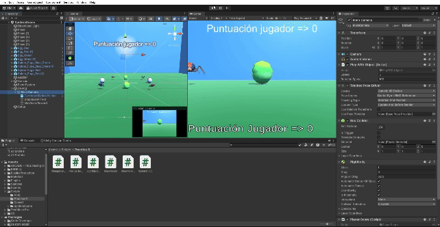

# Interfaces Inteligentes

- Hugo Hernández Martín (alu0101481227@ull.edu.es)

# Práctica 6: Escenas de recolección con SDK de Google Cardboard

Se ha desarrollado una escena con una mecánica de recolección haciendo uso de algunos paquetes de la Asset Store, en específico, los usados en la práctica anterior que definen modelos de arañas y de huevos de arañas.

La mecánica de recolección es la siguiente:

- Se busca recoger huevos de araña hasta alcanzar los 100 puntos.
- Los huevos rojos (tipo 1) suman 5 puntos al jugador por cada huevo recolectado.
- Los huevos verdes (tipo 2) suman 10 puntos al jugador por cada huevo recolectado.
- Cada vez que se recolecta un huevo, éste es teleportado en la escena a un nuevo lugar (limitando la región para que siga siendo accesible para el jugador).
- Se muestra en pantalla los puntos actuales del jugador.
- Cuando se llega al objetivo de puntos (100 puntos), saldrá un cartel que lo anunciará y las arañas se desplazarán al huevo referencia de su tipo:
    - Las arañas de tipo 1 se moverán hacia la posición del huevo de referencia de tipo 1.
    - Las arañas de tipo 2 se desplazarán a la posición del huevo de referencia de tipo 2.

Para implementar esta dinámica se ha recuperado una versión de la escena de la práctica pasada que contiene:
- Dos arañas físicas perfectas de tipo 1 (rojas).
- Dos arañas físicas perfectas de tipo 2 (verdes).
- Dos huevos físicos perfectos de tipo 1 (rojos).
- Dos huevos físicos perfectos de tipo 2 (verdes).
- Cámara cinemática.

Durante el desarrollo de la práctica se han implementado los siguientes Scripts:

- [Movimiento de la cámara.](./scripts/PlayWithObject.cs)
- [ObjectCotroller de los huevos que notifica la "mirada" de la cámara y teleporta los huevos.](./scripts/EggObjectController.cs)
- [Dinámica de recolección de huevos.](./scripts/PlayerScore.cs)
- [Muestra y actualización de la puntuación en el Canvas.](./scripts/ChangeCanvasScore.cs)
- [Muestra y actualización de la puntuación como GraphicsAPIText.](./scripts/ChangeGraphicsAPIText.cs)
- [Desplazamiento de arañas a los huevos de referencia al lograr 100 puntos.](./scripts/SpiderToEgg.cs)
- [Muestra de cartel de máxima puntuación.](./scripts/ShowMaxScore.cs)

A continuación se muestra un ejemplo de ejecución:

- En el ordenador:
    - 
- En el móvil:
    - 